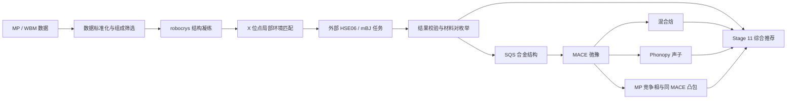

# SS-Screen 软件阶段性汇报

**汇报日期：** 2026-08-04  
**汇报人：** 待填写  
**项目版本：** `ss-screen 0.1.0`  
**项目形态：** Python 软件包与 Bash 命令行工具  
**当前阶段：** Stage 1–12 路线图基线已实现；目标带隙检索和缺陷排序尚未完成

## 1. 汇报摘要

SS-Screen 面向带隙可调固溶体候选筛选，目标是把原本分散在多个 Jupyter notebook、辅助脚本和计算目录中的科研流程，迁移为一个可测试、可追溯、可重复执行的 Python 命令行软件。

当前软件已覆盖从 Materials Project（MP）/WBM 数据标准化，到组成筛选、局部结构环境匹配、外部高精度带隙结果接收、材料对枚举，再到 SQS、MACE 弛豫、混合焓、声子、竞争相凸包和综合推荐的 Stage 1–11 文件链路；Stage 12 已补齐中文手册、示例和统一 CPU 端到端 CI 夹具。软件已经通过 158 项自动测试，并完成一次三种真实 MP 结构的端到端教学演练。

需要明确的是：目前完成的是“候选生成与稳定性预筛软件链路”，不是已经得到正式的新材料结论。教学案例中的带隙是合成数据，MLP 结果不能替代最终 DFT；Stage 11 只是可审计的决策支持，目标带隙查询和缺陷排序仍属于后续工作。

## 2. 科学问题与软件目标

### 2.1 科学问题

项目希望寻找能够形成固溶体、并可通过改变组分连续调节带隙的材料端元组合。筛选至少需要回答三个问题：

1. 两个端元是否具有足够接近的晶体结构和局部配位环境？
2. 两个端元的带隙是否覆盖希望调节的范围？
3. 中间组分在结构、动力学和竞争相意义下是否值得进一步研究？

### 2.2 软件化目标

原始研究流程以 notebook 为主，存在路径硬编码、参数分散、阶段间接口不统一、失败记录不完整和结果难以复现等问题。SS-Screen 的工程目标是：

- 将科研算法迁移到版本化的 `src/ssscreen/` 正式源码；
- 将筛选阈值集中为具名参数，并通过 CLI 显式传入；
- 为每个阶段定义清晰的输入、输出、状态和 provenance；
- 将昂贵的 HSE06/mBJ/DFT 执行与核心软件解耦；
- 对缺失、失败、不收敛和来源不兼容结果进行显式审计；
- 用自动测试和微型夹具保护核心科学行为。

## 3. 核心科学方法

### 3.1 局部环境匹配

SS-Screen 的科学核心是局部环境匹配：将准备发生合金化替换的元素位点统一重标记为占位元素 `X`，再比较 robocrystallographer 给出的局部配位环境。这样可以把化学元素不同、但结构原型与局部环境相同的材料归入同一候选组。

```text
真实组成：CaS、CaSe、CaTe
模板组成：CaX、CaX、CaX
结构判断：比较 X 位点及其他位点的局部配位环境
输出结果：同结构端元组，再结合带隙结果枚举可合金化材料对
```

该方法提供的是候选筛选条件，不是“必然形成稳定固溶体”的充分证明。空间群、晶格失配、带隙弯曲、有限温自由能、缺陷和实验合成条件仍需在后续验证中处理。

### 3.2 Stage 11 可审计推荐

Stage 11 以 `pair_index + structure_id` 为推荐单元，连接端元带隙、SQS 混合焓、声子和竞争相凸包。它不计算不透明的综合分数，而是同时输出推荐等级、证据等级、正向证据、风险、缺失数据和建议的下一步。

| 维度 | 含义 |
|---|---|
| `promising` | 核心 L5 证据完整，且没有触发配置的负面或不确定信号 |
| `uncertain` | 核心证据缺失、失败、冲突、模型不兼容或落在边界区间 |
| `low-priority` | 出现高混合焓、显著虚频、高凸包距离或高风险缺陷等明确负面信号 |
| L2–L6 | 从结构匹配端元对逐步增加高精度带隙、混合焓、声子/凸包和缺陷证据；等级只表示证据完整度，不等同于结论正负 |

当前默认初筛阈值为：混合焓 `<=25 meV/atom` 视为正向、`>50 meV/atom` 视为低优先级；同 MLP 凸包距离 `<=0.025 eV/atom` 视为正向、`>0.1 eV/atom` 视为低优先级。它们都是可配置的研究起点，不是普适物理常数。

## 4. 软件架构与数据流



高精度带隙计算固定在软件外部执行。SS-Screen 负责导出确定性任务 ID、结构哈希和方法模板，并在结果返回后校验任务、材料、结构、方法、设置、数值和重复记录。该边界避免软件与具体集群、商业程序许可证、AiiDA profile、调度器和赝势路径耦合。

## 5. 当前阶段完成情况

| 阶段 | 主要能力 | 当前状态 |
|---|---|---|
| Stage 0 | Python 包、CLI、CI、Ruff/Black/Pytest、依赖分层 | 已完成基础框架 |
| Stage 1 | MP API/离线快照、WBM extxyz 规范化 | MP 已完成；WBM 仅支持消费已构建 extxyz |
| Stage 1a | 组成模板、元素数、带隙、凸包能和排除元素筛选 | 已实现 |
| Stage 2 | robocrys condensation、逐材料 JSON、manifest、索引和校验 | 已实现 |
| Stage 3 | `X` 位点环境匹配和结构分组 | 已实现 |
| Stage 4 | 外部高精度带隙任务/结果契约 | 已实现文件契约；计算本身按设计在包外执行 |
| Stage 5 | 带隙回填、覆盖率、多方法比较和材料对枚举 | 已实现 |
| Stage 6 | random/icet SQS 与端元结构 manifest | 已实现 |
| Stage 7 | MACE FIRE 弛豫、能量/力/应力、QC 和断点恢复 | 已实现 |
| Stage 8 | 同模型、同设置能量基准下的混合焓 | 已实现 |
| Stage 9 | Phonopy 有限位移、MACE 力、频带、DOS 和虚频判据 | 已实现首个 MACE 后端 |
| Stage 10 | MP API/离线竞争相、同 MACE 弛豫和严格凸包 | 已实现 |
| Stage 11 | 汇总带隙、混合焓、声子、凸包和可选缺陷证据的可审计推荐 | 已实现 |
| Stage 12 | 文档、示例和每阶段可复现夹具 | 已实现首个统一 Stage 1–11 CPU CI 夹具和中文手册基线 |

## 6. 软件工程状态

### 6.1 当前实现

- 发布名：`ss-screen`；Python 导入名：`ssscreen`；
- 运行环境：项目本地 Python 3.11.15；
- 代码布局：标准 `src/` 目录；
- CLI：14 个顶层命令，`stability` 下提供 11 个子命令；
- 正式源码：25 个 Python 文件；
- 测试组织：21 个 Python 测试文件，参数化展开后共 158 项，当前全部通过；
- 静态检查：Ruff 通过；`pip check` 无损坏依赖；
- 格式检查：仍有 3 个历史脚本/测试文件存在 Black 格式差异；
- 文档：项目计划、项目日志、四份核心算法/契约说明、中文 Markdown/Word 手册和 ZMD 导航；
- 历史资料：约 54 MB 经整理的 notebook/源码快照，正式实现仍以 `src/` 为准。

### 6.2 已建立的可靠性机制

- 确定性任务 ID、结构 SHA-256 和模型 SHA-256；
- 原子写入，避免半写文件被误认为成功；
- `success`、`not_converged`、`failed`、`skipped` 等显式状态；
- 任务指纹一致时断点恢复，设置变化时拒绝错误复用；
- 完整保存能量、力、应力、收敛状态和结构质量检查；
- 热力学计算拒绝混用模型、精度或弛豫设置不一致的能量；
- Stage 1--11 统一 CPU 夹具在两个独立临时目录重复构建关键产物，并核对相同推荐结果；
- 密钥不写入代码或结果文件，MP API 使用标准配置或隐藏输入；
- 大型数据库、模型和计算输出不进入 Git 仓库。

### 6.3 当前版本管理状态

Stage 7–12、ZMD 和中文手册等主要成果目前仍主要存在于开发工作树，尚需完成正式代码审查、提交、版本标记和发布整理。因此，当前应表述为“可运行的开发版本”，而不是已经发布的稳定版。

### 6.4 统一端到端 CI 夹具

`tests/test_e2e_pipeline.py` 使用三个合成 rock-salt 端元，真实执行组成筛选、环境匹配、gap 任务导出/校验、材料配对、random SQS、混合焓和 Stage 11 推荐，并连续运行两次核对结果可复现。Stage 7、9、10 使用模型 SHA 和设置一致的确定性测试记录，只验证文件契约和证据连接，不加载 MACE、不运行 Phonopy、不查询 MP，也不产生科研结论。该测试在普通 CPU 上约 8 秒完成，并由现有 `pytest` CI 自动收集。

## 7. 新用户教学演练

### 7.1 演练范围

教学演练使用 MP 离线快照中的三个真实 rock-salt 结构：CaS、CaSe 和 CaTe。流程覆盖组成筛选、robocrys 凝练、结构分组、合成带隙契约验证、材料配对、icet SQS、MACE 弛豫、混合焓、Phonopy 声子、离线 MP 竞争相凸包和 Stage 11 综合推荐。

### 7.2 教学结果

| 候选 | 混合焓（meV/atom） | MACE 凸包距离（meV/atom） | 声子预筛 | Stage 11 输出 | 教学判断 |
|---|---:|---:|---|---|---|
| CaSe0.5S0.5 | +10.417 | 10.451 | 无显著虚频 | `promising` / L5 | 当前相对更强，保留进一步验证 |
| CaTe0.5S0.5 | +79.114 | 79.113 | 最低频率 -2.735 THz | `low-priority` / L5 | 当前降级；先复核高混合焓与虚频 |

两条候选均达到 L5，说明带隙、混合焓、声子和凸包证据已经齐备；CaTe-CaS 仍为 `low-priority`，说明“证据完整”不等于“结论正向”。本次没有提供缺陷表，因此结果明确记录 `defects:not_requested`；默认配置下这不会把完整 L5 证据自动降为 `uncertain`。未使用 NAC 和离线 MP 快照范围也保留在风险字段中。

### 7.3 科学边界

以上结果只能证明软件链路可以运行和区分候选，不能作为正式新材料结论，原因包括：

- 带隙为合成教学数据，不是真实 HSE06/mBJ 结果；
- 只使用了 `x=0.5` 和 16 原子 SQS；
- 教学声子使用较小超胞，且未加入 NAC；
- 稳定性来自 MACE 势能面，不是最终 DFT；
- 竞争相完整性只相对于固定的 2023 MP 离线快照；
- 尚未完成多组分、随机种子、模型、超胞和参数收敛检查。

## 8. 当前主要缺口

### 8.1 产品能力

- 目前不能直接输入 `target_gap` 和容差查询目标固溶体；
- 尚无用户结构/私有计算结果的统一上传 schema；
- 尚未支持 MP×MP、用户×MP、用户×用户的统一检索；
- 目标组分的带隙 bowing 模型和不确定度尚未定义；
- Stage 11 默认阈值仍需在更多真实体系上校准，当前推荐只适合作为预筛决策支持。

### 8.2 数据与兼容性

- WBM 原始五个 step、summary 唯一对齐和 extxyz 可追溯构建尚未迁移；
- 历史三元 group JSON 的 `Compositions` 字段兼容尚未修复；
- 外部高精度带隙缺失时的可选 PBE fallback 尚未实现；
- 完整 MP 数据表应在仓库外生成并进行全量统计与抽样核验。

### 8.3 科学验证

- 需要真实 VASP HSE06、ABACUS HSE06、mBJ 或经批准方法的带隙结果；
- 需要多个组分点、更大 SQS 和关联函数/随机种子收敛；
- 需要声子超胞与位移幅度收敛，极性体系需要 Born 电荷、介电张量和 NAC；
- 需要用当前在线 MP 或更新快照复核竞争相；
- 重点候选、端元和关键分解相需要统一设置的 DFT 能量复核；
- 缺陷形成能、化学势和阳/阴离子缺陷排序尚未实现。

### 8.4 软件成熟度

- 尚无全局 DAG 和统一的 Run/Task/Attempt/Artifact 状态模型；
- 尚无工作流级重试、元数据数据库和内容寻址制品存储；
- MACE 之外的 MatterSim/eSEN/TorchSim 批处理后端尚未接入；
- 当前大型运行仍需用户自行管理目录和阶段命令。

## 9. 下一阶段建议

### 9.1 近期：收拢当前开发版本

1. 审查并版本化 Stage 1–12 当前工作树；
2. 修复 Black、历史归档换行校验和文档状态漂移；
3. 冻结当前阶段产物 schema，并建立正式版本标签；
4. 保持统一端到端夹具在普通 CPU 上低于约 10 秒，并在 schema 变更时显式审查预期结果。

### 9.2 产品 MVP：目标带隙与用户数据双入口

1. 编写目标带隙检索设计规范并更新正式项目计划；
2. 定义 `ScreenRequest`、`MaterialRecord`、`CalculationRecord`、`AlloyCandidate` 和 `ValidationJob`；
3. 建设 MP 组成模板、环境指纹和 gap/provenance 预计算索引；
4. 实现 `target_gap/tolerance` 查询；
5. 实现用户结构和计算结果规范化；
6. 实现 MP×MP、用户×MP、用户×用户混合匹配；
7. 将预测目标组分传递到 SQS 和显式带隙验证任务。

### 9.3 科研验证与最终决策

1. 接入真实高精度带隙结果；
2. 完成 SQS、声子和凸包收敛研究；
3. 使用真实体系校准 Stage 11 阈值并验证分类稳定性；
4. 设计并实现缺陷计算/排序边界；
5. 对优先候选开展一致设置的 DFT 验证。

## 10. 希望老师确认的问题

1. 下一阶段应优先推进“目标带隙查询产品”，还是优先补齐缺陷排序和真实体系验证？
2. 目标带隙的首个示范范围和允许误差应如何设定？
3. 首版是否接受线性插值，还是必须从开始就纳入 bowing 参数与不确定度？
4. 哪一种高精度带隙方法应作为首个正式验证基准？
5. 哪些候选体系值得优先投入更大 SQS、声子和 DFT 资源？
6. 软件成果的近期交付形式应是实验室内部 CLI、可发布 Python 包，还是进一步开发 Web/API 服务？

## 11. Bash 现场演示建议

现场只展示 CLI、已有产物和审计信息，不重新运行 MACE、声子、在线 MP 或 DFT 作业。

```bash
cd /vepfs-mlp2/project-battery/zuolong/ss-screen-learning-20260722
source .venv/bin/activate

python --version
python -c "import ssscreen; print(ssscreen.__version__)"
ss-screen --help
ss-screen stability --help
ss-screen recommend --help
```

查看教学结果：

```bash
less work/new-user-tutorial/12_recommendation/recommendation_report.md

python -c "
import pandas as pd
print(pd.read_csv(
    'work/new-user-tutorial/06_pairs/final_pairs.csv'
).to_string(index=False))
"
```

如需现场证明 Stage 11 可以从已有产物重新生成报告，可运行下面的轻量聚合命令。它不调用 MACE、Phonopy、在线 MP 或 DFT：

```bash
ss-screen recommend \
  --pairs work/new-user-tutorial/06_pairs/final_pairs.csv \
  --gap-results work/new-user-tutorial/05_bands/gap_results.normalized.csv \
  --mixing-enthalpy work/new-user-tutorial/09_thermodynamics/mixing_enthalpy.csv \
  --phonons work/new-user-tutorial/10_phonons/phonon_summary.csv \
  --phase-stability work/new-user-tutorial/11_phase_diagram_offline/phase_stability.csv \
  --output work/new-user-tutorial/12_recommendation/recommendations.csv \
  --report work/new-user-tutorial/12_recommendation/recommendation_report.md \
  --summary work/new-user-tutorial/12_recommendation/recommendation_summary.json
```

建议现场演示顺序控制在 2–3 分钟：

1. `ss-screen --help`：证明软件已经形成完整命令树；
2. `ss-screen stability --help`：展示 Stage 6–10；
3. `final_pairs.csv`：展示候选材料对；
4. Stage 11 报告：展示软件如何综合带隙、混合焓、声子和凸包证据，并解释 `promising`、`low-priority` 与 L5 的区别；
5. 明确说明结果是教学验证，不是正式科研发现。

## 12. 总结

SS-Screen 已经把原始 notebook 研究流程中的核心筛选算法和主要稳定性预筛步骤，迁移为一条具有明确文件契约、失败状态、provenance、统一端到端 CI 夹具和自动测试的 Stage 1–12 Python CLI/文档基线。当前最大的价值是流程工程化和可复现性，而不是已经获得最终材料结论。

下一阶段的关键选择，是在现有科学内核之上优先建设目标带隙/用户数据产品入口，还是先完成缺陷与真实体系验证链。无论选择哪条路线，正式科研结论都需要真实高精度带隙、收敛的 SQS/声子/凸包计算和统一设置的 DFT 复核。

## 参考材料

- [项目日志](PROJECT_LOG.md)
- [项目计划](PROJECT_PLAN.md)
- [结构分组算法](algorithm_structure_grouping.md)
- [带隙回填与材料配对算法](algorithm_gap_backfill_pairing.md)
- [竞争相与同 MACE 凸包算法](algorithm_competing_phase_hull.md)
- [Stage 11 综合推荐算法](algorithm_recommendation.md)
- [完整功能版中文用户手册](user-guide/SS-Screen_完整功能版_用户使用手册.md)
- [新用户教学演练审计报告](../work/new-user-tutorial/12_report/README.md)
