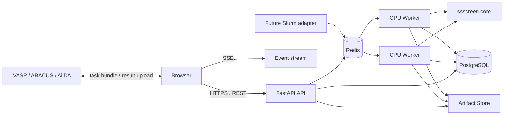

# SS-Screen Web 平台开发指南

**文档状态：** 开发基线草案  
**适用范围：** 方案二，React/TypeScript + FastAPI + PostgreSQL + Redis/Celery  
**编制日期：** 2026-08-26  
**依赖的软件基线：** `ss-screen 1.0` 当前工作树  

## 1. 文档目的

本指南用于把现有 `ss-screen` Python 包和 Stage 1--11 文件流水线扩展为实验室多用户 Web 平台。它固定首版架构、领域对象、状态机、API、页面、任务编排、存储、安全和测试边界，使后续开发可以直接拆分任务，而不在实现过程中反复重做基础决策。

Web 平台不是新的科学实现。现有 `src/ssscreen/` 仍是数据标准化、结构匹配、带隙契约、SQS、MACE、声子、凸包和推荐逻辑的唯一权威来源。Web 平台只增加：

- 项目、运行、任务和制品管理；
- 多用户访问与权限控制；
- 长任务异步执行、恢复、重试和取消；
- 浏览器中的配置、状态、证据和错误展示；
- 外部 VASP/ABACUS/AiiDA 任务包交接；
- 面向未来 Slurm/AiiDA 执行适配器的稳定边界。

## 2. 基线判断与开发原则

### 2.1 可以直接复用的能力

当前正式包已经提供适合作为 Worker 入口的 Python 函数，包括：

| 阶段 | 现有 Python 入口 | Web 平台职责 |
|---|---|---|
| Stage 1 | `data.mp.load_mp_dataset`、`data.wbm.load_wbm_dataset` | 收集参数、分配运行目录、登记数据集和 provenance |
| Stage 2 | `data.condense.condense_dataframe`、`validate_archive` | 创建批任务、展示逐材料状态和归档完整性 |
| Stage 3 | `pair.structure_match.match_structure_candidates` | 登记结构组、缺失描述和分组统计 |
| Stage 4 | `pair.gap_export.export_gap_candidates`、`gap_collect_vasp.collect_vasp_gap_results`、`gap_export.validate_gap_results` | 下载任务包、等待外部结果、上传并审计返回文件 |
| Stage 5 | `pair.gap_feedback.generate_pairs_from_gap_results`、`compare_gap_methods` | 保存候选材料对并提供查询视图 |
| Stage 6 | `stability.sqs.generate_sqs_inputs` | 提交 CPU/icet Worker，展示结构与 manifest |
| Stage 7 | `stability.relax.relax_manifest`、`stability.mlp.MaceRelaxationBackend` | 调度 GPU Worker，展示收敛、能量、力、应力和 QC |
| Stage 8 | `stability.thermodynamics.calculate_mixing_enthalpies` | 校验共同能量基准并生成证据表 |
| Stage 9 | `stability.phonon.run_phonon_pipeline` 及分阶段入口 | 调度位移力任务、汇总频谱和图形制品 |
| Stage 10 | `stability.competing.run_phase_diagram_pipeline` 及分阶段入口 | 管理 MP 查询、竞争相 Worker 和凸包完整性 |
| Stage 11 | `stability.recommendation.generate_recommendations` | 查询、排序并展示可审计推荐 |

### 2.2 必须新增的能力

当前 CLI 没有全局 `Project / Run / Task / Attempt / Artifact` 模型，也没有数据库、用户权限和工作流级恢复。Web 开发首先要补控制层，不能先从页面按钮直接调用 Click 命令。

### 2.3 强制原则

1. `src/ssscreen/` 不得依赖 FastAPI、SQLAlchemy、Celery、Redis 或任何前端包。
2. Web 后端可以依赖 `ssscreen`；`ssscreen` 不得反向依赖 Web 后端。
3. 正式 Worker 直接调用 Python 函数。不得把 `subprocess("ss-screen ...")` 作为核心执行方式。
4. PostgreSQL 只保存元数据、状态、索引和小型 JSON；大型结构、CSV、JSONL、HDF5、图和模型保存在外部制品存储。
5. 所有制品保存 SHA-256、schema 版本、产生它的 Attempt 和科学核心版本。
6. 浏览器不得接触 `MP_API_KEY`、数据库密码、Redis 密码或集群凭据。
7. 任务生命周期状态与科学结果状态分开保存。例如 Worker 可以正常结束，但科学结果仍为 `not_converged`。
8. 缺失、失败、不收敛、不兼容和来源警告必须在 UI 中保持可见，不得被默认筛选隐藏。
9. VASP、ABACUS 和 AiiDA 高精度带隙执行继续保持包外边界。
10. 完整数据集、模型和计算结果必须写入配置的仓库外目录或对象存储。

## 3. 产品范围

### 3.1 首版用户

- 计算材料研究人员：建立筛选项目、配置参数、运行轻量阶段；
- 计算任务执行人员：下载外部带隙任务、上传结果、处理失败任务；
- 稳定性分析人员：提交 SQS/MLP/声子/凸包任务并审查证据；
- 项目负责人：比较候选、查看来源和审计记录；
- 系统管理员：管理 Worker、存储、配额和失败队列。

### 3.2 MVP 范围

首个可交付 MVP 只覆盖 Stage 1--5：

- 项目和成员；
- 数据集登记或上传；
- 组成筛选、condense、结构匹配；
- gap 任务导出、任务包下载、外部等待、结果上传和校验；
- 材料对表、覆盖率、失败审计和制品下载；
- 全流程异步状态、事件、重试和取消；
- 开发环境身份与生产 OIDC 接口。

Stage 6--11 在 MVP 数据模型稳定后接入。MVP 不承诺目标带隙查询、用户×MP 混合索引、缺陷计算、Slurm/AiiDA 托管执行或公开互联网服务。

### 3.3 非目标

- 不在 Web 服务器进程内运行 MACE、Phonopy、VASP 或长时间 robocrys 批任务；
- 不把 PostgreSQL 当作任意二进制文件仓库；
- 不在首版提供通用工作流画布或允许用户执行任意 Shell；
- 不把 Stage 11 推荐包装成材料稳定性或可合成性证明；
- 不为已有科学 CSV/JSONL 发明不兼容的第二套字段定义。

## 4. 总体架构



### 4.1 固定技术选择

| 层 | 选择 | 理由 |
|---|---|---|
| 前端 | React + TypeScript + Vite | 适合数据密集型单页应用，开发和部署边界清晰 |
| 路由/请求 | TanStack Router、TanStack Query | 类型化路由、缓存、失效和轮询控制 |
| 表格 | TanStack Table + 按需虚拟化 | 候选和任务表需要服务端分页、筛选和大列表 |
| 组件 | Tailwind CSS + shadcn/ui/Radix + Lucide | 可访问的基础控件和一致图标，不引入大型视觉主题 |
| 图表 | Apache ECharts，并提供表格替代 | 覆盖排序、分布、散点和趋势，适合较大数据量 |
| 结构查看 | 懒加载 3Dmol.js 适配层 | 只在材料详情页加载晶体结构视图 |
| API | FastAPI + Pydantic | 与 Python 科学包边界自然，自动 OpenAPI |
| ORM/迁移 | SQLAlchemy 2 + Alembic | 明确事务和可审查数据库迁移 |
| 数据库 | PostgreSQL | 支持并发、JSONB、索引和可靠锁语义 |
| 队列 | Celery + Redis broker | CPU/GPU 队列隔离、重试、路由和后续集群适配 |
| 实时状态 | Server-Sent Events | 状态和日志主要为服务端单向推送，首版不需要 WebSocket |
| 制品存储 | `ArtifactStore` 接口；先 NFS，后 MinIO/S3 | 保持部署可替换，避免业务代码硬编码路径 |
| 认证 | OIDC；开发环境使用受限的开发身份 | 不自行维护生产密码体系 |
| 部署 | 容器化服务 + Compose 起步 | 适合实验室服务器；后续可迁移到集群或 Kubernetes |

### 4.2 仓库建议布局

```text
ss-screen-learning-20260722/
├── src/ssscreen/                 # 现有科学核心，不引入 Web 依赖
├── web/
│   ├── backend/
│   │   ├── pyproject.toml        # 依赖本仓库 ss-screen 和 Web 后端包
│   │   ├── src/ssscreen_web/
│   │   │   ├── api/              # FastAPI router、请求/响应 schema
│   │   │   ├── application/      # use case、事务、权限和 StageRunner
│   │   │   ├── domain/           # Project/Run/Task/Artifact 状态规则
│   │   │   ├── infrastructure/   # PostgreSQL、Redis、ArtifactStore、OIDC
│   │   │   └── workers/          # Celery task 和队列路由
│   │   ├── migrations/
│   │   └── tests/
│   ├── frontend/
│   │   ├── src/
│   │   │   ├── app/              # 路由、provider、全局错误边界
│   │   │   ├── features/         # projects/runs/tasks/candidates/artifacts
│   │   │   ├── components/       # 共享表格、状态、表单和布局
│   │   │   └── api/              # 从 OpenAPI 生成的客户端和查询 hooks
│   │   └── tests/
│   └── deploy/
│       ├── compose.yaml
│       ├── env.example
│       └── reverse-proxy/
└── tests/                         # 现有核心测试继续独立运行
```

`web/backend` 是独立可安装包，依赖根目录的 `ss-screen`。这样核心用户仍可以只安装 CLI，不被 Web 依赖拖入。

## 5. 领域模型

### 5.1 核心实体

| 实体 | 关键字段 | 说明 |
|---|---|---|
| `User` | `id`、`subject`、`display_name`、`status` | OIDC subject 是外部身份主键 |
| `Project` | `id`、`name`、`description`、`owner_id`、`retention_policy` | 权限、数据和运行的顶层边界 |
| `ProjectMember` | `project_id`、`user_id`、`role` | `owner/editor/viewer` 三种首版权限 |
| `Dataset` | `id`、`project_id`、`kind`、`artifact_id`、`provenance` | MP/WBM/用户规范表的登记记录 |
| `Run` | `id`、`project_id`、`pipeline_version`、`status`、`configuration` | 一次可恢复的筛选运行 |
| `Task` | `id`、`run_id`、`stage`、`task_type`、`status`、`depends_on` | 工作流中的逻辑任务 |
| `Attempt` | `id`、`task_id`、`number`、`worker`、`status`、`settings_hash` | 每次真实执行；重试不覆盖历史 |
| `Artifact` | `id`、`project_id`、`attempt_id`、`kind`、`uri`、`sha256`、`size` | 不可变制品元数据 |
| `Event` | `id`、`run_id`、`task_id`、`kind`、`payload`、`created_at` | 状态变化、警告、审计和 UI 推送来源 |
| `Candidate` | `id`、`run_id`、`pair_index`、`structure_id`、`classification` | Stage 5/11 查询投影，不替代原始 CSV |
| `ExternalJob` | `id`、`task_id`、`method`、`status`、`task_artifact_id` | gap 外部交接和回收状态 |

所有实体使用不可猜测的 UUID。用户可读编号另存展示字段，不用数据库自增 ID 作为下载授权依据。

### 5.2 运行与任务状态

运行状态：

```text
DRAFT -> QUEUED -> RUNNING
                    |  \
                    |   -> WAITING_EXTERNAL -> RUNNING
                    |   -> PARTIAL
                    |   -> FAILED
                    |   -> CANCELLED
                    -> SUCCEEDED
```

任务状态：

```text
PENDING -> READY -> QUEUED -> RUNNING -> SUCCEEDED
                     |          |  |       |
                     |          |  |       -> scientific_status may be not_converged
                     |          |  -> FAILED -> READY (explicit retry)
                     |          -> CANCEL_REQUESTED -> CANCELLED
                     -> WAITING_EXTERNAL -> READY
```

约束：

- `Task.status` 描述编排生命周期；`Task.scientific_status` 描述领域结果；
- `WAITING_EXTERNAL` 不属于失败；
- `PARTIAL` 表示流程完成但存在被允许的缺失或失败证据；
- 重试创建新 Attempt，旧 Attempt 和制品保持不可变；
- 只有数据库事务可以推进状态；Celery 自身状态不是权威来源；
- 每次状态变化必须同时写 `Event`，供 SSE 和审计使用。

### 5.3 Stage 定义

后端维护版本化 `PipelineDefinition`，而不是由前端自行拼接阶段。首版可定义：

```text
stage-1-dataset
  -> stage-1a-composition
  -> stage-2-condense
  -> stage-3-structure-match
  -> stage-4-gap-export
  -> stage-4-gap-wait
  -> stage-4-gap-validate
  -> stage-5-pair
```

Stage 6--11 在后续定义中作为可选分支加入。数据库中的 `pipeline_version` 必须固定定义版本；升级定义不能改变历史 Run。

## 6. 制品和运行目录

### 6.1 ArtifactStore 接口

```python
class ArtifactStore(Protocol):
    def put_file(self, source: Path, *, key: str, content_type: str) -> StoredArtifact: ...
    def open_read(self, key: str) -> BinaryIO: ...
    def materialize(self, key: str, destination: Path) -> Path: ...
    def delete(self, key: str) -> None: ...
```

初始 `FileSystemArtifactStore` 使用管理员配置的仓库外根目录。业务代码只能使用逻辑 key，不得拼接任意用户输入路径。后续 `S3ArtifactStore` 保持相同接口。

### 6.2 逻辑 key

```text
projects/{project_uuid}/
  datasets/{dataset_uuid}/{artifact_uuid}/{filename}
  runs/{run_uuid}/
    tasks/{task_uuid}/attempts/{attempt_number}/inputs/...
    tasks/{task_uuid}/attempts/{attempt_number}/outputs/...
```

### 6.3 不可变性和去重

- Attempt 输出完成后不可原地修改；
- 同一内容可以按 SHA-256 做物理去重，但每个 Artifact 保持独立授权记录；
- 上传完成前使用临时 key，校验大小、SHA 和 schema 后原子发布；
- 下载文件名来自服务端登记值，并设置安全的 `Content-Disposition`；
- 删除 Project 使用延迟清理队列，先标记，再按保留策略删除制品；
- 模型 checkpoint 单独登记 `ModelAsset` 或只由 Worker 配置引用，不允许普通用户上传覆盖。

## 7. 应用服务和 StageRunner

### 7.1 禁止把 API Router 写成科学脚本

Router 只负责认证、权限、请求校验和调用 use case。数据库事务、制品物化和核心函数调用放在应用服务与 Worker 中。

```text
FastAPI Router
  -> Application Use Case
    -> Repository / Unit of Work
    -> enqueue Task
      -> Celery Worker
        -> StageRunner
          -> ssscreen Python function
          -> ArtifactStore
          -> transactionally finalize Attempt
```

### 7.2 StageRunner 契约

每个 StageRunner 必须实现：

```python
class StageRunner(Protocol):
    stage: str

    def prepare(self, context: TaskContext) -> PreparedTask: ...
    def execute(self, prepared: PreparedTask) -> StageResult: ...
    def validate(self, result: StageResult) -> ValidationResult: ...
    def publish(self, result: StageResult, context: TaskContext) -> list[ArtifactSpec]: ...
```

要求：

- `prepare` 将授权制品物化到 Attempt 沙箱；
- `execute` 调用现有 Python API，不修改源制品；
- `validate` 检查现有 schema、状态和所需文件；
- `publish` 只登记通过验证的输出，并保存 summary；
- `settings_hash`、输入 Artifact SHA 列表和核心版本共同组成幂等指纹；
- 指纹完全一致时可以复用已成功结果，但必须登记复用事件；
- 任务超时、软取消和 Worker 丢失都要生成明确失败原因。

### 7.3 队列划分

| 队列 | 任务 | 默认并发原则 |
|---|---|---|
| `control` | 小型校验、摘要、通知 | 高并发、短超时 |
| `cpu` | 数据转换、组成筛选、结构匹配、推荐 | 按 CPU/内存限制 |
| `condense` | robocrys 批任务 | 独立限流，避免占满普通 CPU Worker |
| `gpu-relax` | MACE 弛豫和竞争相 | 每 GPU 固定 Worker/并发 |
| `gpu-phonon` | 位移力任务 | 可按位移任务切分并恢复 |
| `external` | gap 等待、上传校验 | 不占用长期 Worker |

Redis 只作 broker 和短期协调。业务状态、错误和最终结果全部落 PostgreSQL/ArtifactStore。

## 8. API 设计

### 8.1 通用规则

- 所有接口位于 `/api/v1`；
- OpenAPI 是前后端契约来源，TypeScript 客户端自动生成；
- 列表使用服务端分页、排序和白名单筛选字段；
- POST 创建操作支持 `Idempotency-Key`；
- 错误响应包含稳定 `code`、用户可读 `message`、字段错误和 `trace_id`；
- 权限检查按 Project 执行，不能只依赖前端隐藏按钮；
- 时间统一使用带时区 ISO 8601；
- 单位进入字段名或 schema 描述，不依赖页面文案猜测。

### 8.2 MVP 端点

```text
GET    /api/v1/me
GET    /api/v1/projects
POST   /api/v1/projects
GET    /api/v1/projects/{project_id}
PATCH  /api/v1/projects/{project_id}

POST   /api/v1/projects/{project_id}/datasets/uploads
POST   /api/v1/projects/{project_id}/datasets/register
GET    /api/v1/projects/{project_id}/datasets
GET    /api/v1/datasets/{dataset_id}

POST   /api/v1/projects/{project_id}/runs
GET    /api/v1/projects/{project_id}/runs
GET    /api/v1/runs/{run_id}
POST   /api/v1/runs/{run_id}/actions/start
POST   /api/v1/runs/{run_id}/actions/cancel
GET    /api/v1/runs/{run_id}/events

GET    /api/v1/runs/{run_id}/tasks
GET    /api/v1/tasks/{task_id}
POST   /api/v1/tasks/{task_id}/actions/retry
POST   /api/v1/tasks/{task_id}/actions/cancel

POST   /api/v1/external-jobs/{job_id}/result-uploads
GET    /api/v1/external-jobs/{job_id}/task-bundle
POST   /api/v1/external-jobs/{job_id}/actions/validate

GET    /api/v1/runs/{run_id}/candidates
GET    /api/v1/candidates/{candidate_id}
GET    /api/v1/runs/{run_id}/artifacts
GET    /api/v1/artifacts/{artifact_id}/download
```

### 8.3 SSE 事件

`GET /runs/{run_id}/events` 使用事件游标恢复，至少支持：

- `run.status_changed`；
- `task.status_changed`；
- `task.progress`；
- `task.warning`；
- `artifact.published`；
- `external_job.waiting`；
- `external_job.results_received`。

SSE 只发送授权项目的结构化事件，不直接广播 Worker 原始 stdout。完整日志作为受控制品或分页接口读取。

## 9. 前端信息架构

### 9.1 页面

| 路由 | 主要内容 |
|---|---|
| `/projects` | 项目列表、最近运行、需处理失败 |
| `/projects/:projectId` | 数据集、运行历史、成员和存储概览 |
| `/projects/:projectId/runs/new` | 分步配置、输入验证和运行摘要 |
| `/runs/:runId` | Stage 台账、实时状态、错误和制品 |
| `/runs/:runId/candidates` | 候选表、覆盖率、分类和批量导出 |
| `/candidates/:candidateId` | 结构、端元、gap、混合焓、声子、凸包和风险证据 |
| `/external-jobs/:jobId` | 任务包下载、方法信息、结果上传和拒绝行 |
| `/artifacts/:artifactId` | 元数据、SHA、schema、预览和下载 |
| `/admin/workers` | 队列、Worker、GPU、失败任务和存储健康状态 |

第一屏直接进入项目/运行工作台，不制作营销落地页。

### 9.2 页面布局

- 左侧固定宽度项目导航；桌面端可收起，移动端使用抽屉；
- 顶部只保留项目切换、全局搜索、运行状态和用户菜单；
- Run 页面使用稳定的 Stage 列表与主详情区，不使用横向滚动旅程；
- 候选页以高密度表格为主，统计图只辅助筛选；
- Candidate 详情使用无嵌套卡片的分区布局，结构查看器与证据表并列；
- 宽表格在移动端使用受控横向滚动，并固定关键身份列；
- 长文本、哈希和错误默认截断，提供展开和复制按钮。

### 9.3 视觉与交互规则

- 基础背景使用白/浅灰，中性文本；蓝色只用于主操作；
- 状态颜色同时配合图标和文字：成功、运行中、等待、警告、失败、取消不能只靠颜色区分；
- `promising`、`uncertain`、`low-priority` 使用独立标签，但证据等级与结论分开显示；
- 使用 Lucide 图标，图标按钮必须有 tooltip 和 `aria-label`；
- 所有表单有显式 label，错误显示在字段附近并聚焦首个错误；
- 异步状态使用 `aria-live="polite"`；
- 触控目标至少 44 x 44 px，键盘焦点清晰；
- 动画限定为 150--300 ms 的颜色/透明度反馈，并尊重 `prefers-reduced-motion`；
- 不使用玻璃拟态、装饰渐变、巨大标题、嵌套卡片或营销式 Bento 布局；
- 图表必须提供同数据表格或可下载 CSV。

### 9.4 大表性能

- 所有候选、任务和制品列表默认服务端分页；
- 搜索输入使用延迟值或 250 ms 左右 debounce；
- 大于约 1,000 个可见行时启用行虚拟化；
- 筛选条件写入 URL query，刷新和分享后可恢复；
- 结构查看器、声子图和大 JSON 预览按需加载；
- 页面预先保留异步内容尺寸，避免状态更新导致布局跳动。

## 10. 关键用户流程

### 10.1 新建 Stage 1--5 Run

1. 用户选择 Project 和已登记 Dataset；
2. 页面加载后端提供的版本化参数 schema 和默认值；
3. 用户配置元素数、hull/gap/原子数等阈值；
4. 后端进行语义验证并显示计划生成的 Stage；
5. 用户确认后创建 DRAFT Run；
6. `start` 原子创建任务依赖并入队；
7. Run 页面通过 SSE 更新状态；
8. 到 gap 阶段时 Run 进入 `WAITING_EXTERNAL`；
9. 用户下载任务包，在外部平台计算；
10. 上传结果后先进入隔离区，校验通过才发布规范结果；
11. Stage 5 生成材料对，Run 进入 `SUCCEEDED` 或带明确原因的 `PARTIAL`。

### 10.2 失败恢复

1. Task 失败时显示稳定错误码、发生阶段、最后 Attempt 和恢复建议；
2. 用户查看输入 SHA、设置、日志和已发布制品；
3. 可重试错误提供“重试”命令；不可重试错误要求先修改 Run 配置或输入；
4. 重试创建新 Attempt，不覆盖旧结果；
5. 下游任务只有在所需输入重新发布后才回到 READY；
6. 所有人工操作写入 Event 审计。

### 10.3 外部 gap 交接

- 任务包包含 `gap_tasks.csv`、结构、结果模板和方法元数据模板；
- UI 显示任务数、结构哈希、method 和设置哈希；
- 上传时分别显示 accepted/rejected/missing/not_converged/failed；
- rejected 行可下载，不允许用户在浏览器中强行改为 accepted；
- 覆盖率不足时用户可以继续等待、补传或明确接受 partial，再进入 Stage 5；
- 每次上传产生独立 Artifact 和 Attempt，重复任务不能静默覆盖。

## 11. 安全与权限

### 11.1 身份与授权

- 生产环境通过 OIDC 获取身份；
- 开发身份开关只能在 `APP_ENV=development` 时启用；
- 每个 API use case 都检查 Project role；
- 下载 URL 短期有效并绑定授权，或由 API 流式代理；
- 管理员权限不能隐式授予 Project 数据访问，审计支持需单独记录。

### 11.2 Secret

- `MP_API_KEY`、OIDC client secret、数据库和 Redis 凭据只从环境或 Secret Manager 注入；
- 日志过滤敏感环境变量、Authorization header 和连接串；
- 前端构建变量不得包含服务端密钥；
- Stage 10 在线 MP 查询在 Worker 内读取项目授权的 server-side credential reference，不把密钥写入任务参数或 Artifact。

### 11.3 上传安全

- 限制扩展名、MIME、单文件大小、文件数和解压后总量；
- 拒绝绝对路径、`..`、符号链接和压缩包路径穿越；
- XML 解析沿用安全库配置，不启用外部实体；
- 上传先进入隔离目录，schema 和 SHA 校验后发布；
- 用户提供的文件名只作展示，不作磁盘路径；
- 不允许浏览器上传可执行脚本并由 Worker 执行。

## 12. 科学完整性要求

Web 平台上线不能削弱现有科学约束：

- 所有阈值以具名字段和单位显示；
- UI 保存实际提交配置，而不是只显示当前默认值；
- 外部 gap 校验保持任务、材料、method、结构和设置身份；
- Stage 8--10 保持模型 SHA、dtype、优化器和弛豫设置一致性；
- MP 离线来源显示数据库 SHA、快照范围和警告；
- 未使用 NAC、竞争集不完整、旧快照、缺陷未提供等风险持续可见；
- Stage 11 继续使用显式规则，不在前端另算不透明总分；
- 任何人工覆盖必须生成带操作者和理由的审计事件，不修改原始证据。

## 13. 测试策略

### 13.1 测试层次

| 层 | 工具/范围 | 必须覆盖 |
|---|---|---|
| 科学核心 | 现有 pytest | 166 项基线及后续核心回归不得退化 |
| Domain | pytest | 状态机、权限、幂等、依赖推进、重试和取消 |
| API | pytest + FastAPI client | schema、认证、分页、错误、上传和授权越权 |
| PostgreSQL | 临时真实 PostgreSQL | 事务、锁、JSONB、迁移；不以 SQLite 代替关键测试 |
| Worker | pytest + eager/fake broker | StageRunner、沙箱、制品发布和 Worker 丢失恢复 |
| 前端单元 | Vitest + Testing Library | 表单、状态、错误、权限和无障碍 |
| 浏览器 E2E | Playwright | 新建 Run、等待 gap、上传结果、材料对和重试 |
| 契约 | OpenAPI diff + 生成客户端 | 破坏性 API 变化必须显式审查 |
| 安全 | 专项回归 | 越权下载、路径穿越、危险压缩包和 secret 日志 |

### 13.2 Web 端到端夹具

复用 `tests/data/e2e/` 的三端元数据，在 Web 测试中：

1. 通过 API 创建 Project、Dataset 和 Run；
2. 真实运行轻量 Stage 1--5；
3. 下载 gap task bundle；
4. 上传确定性 gap fixture；
5. 验证材料对和 Artifact SHA；
6. 在两个独立 Project 中运行，确认授权隔离和结果可复现；
7. 不调用网络、GPU、MACE、Phonopy、DFT 或 AiiDA。

Stage 6--11 接入时继续使用确定性后端测试编排，另保留显式真实 GPU 冒烟，不把 GPU 冒烟放入普通 CI。

### 13.3 首版质量门禁

- 核心 pytest 全部通过；
- 后端 Ruff、Black、类型检查和迁移检查通过；
- 前端 lint、类型检查、单元测试和生产构建通过；
- Playwright MVP 主路径通过；
- OpenAPI 无未审查的破坏性变化；
- ZMD 本地链接零失效；
- 容器镜像不包含数据集、模型 checkpoint、API key 或开发 `.env`；
- 备份恢复演练和一个 Worker 丢失恢复场景通过。

## 14. 可观测性和运维

### 14.1 日志

使用结构化 JSON 日志，至少包含：

```text
timestamp, level, service, trace_id, user_id, project_id,
run_id, task_id, attempt_id, worker_id, event_code, message
```

日志不得包含结构文件正文、完整上传内容、密钥或 Authorization header。

### 14.2 指标

- API 延迟、错误率和请求量；
- 各队列深度、最老任务等待时间；
- Task/Attempt 各状态计数和运行时分布；
- Worker 心跳、CPU/GPU 占用和显存；
- ArtifactStore 容量、写入失败和校验失败；
- 外部 gap 等待时长和覆盖率；
- 每个 Stage 的科学失败/不收敛比例。

### 14.3 健康检查

- `/health/live`：进程存活，不访问外部依赖；
- `/health/ready`：数据库、Redis 和 ArtifactStore 最小读写检查；
- Worker 心跳单独登记；
- GPU Worker 启动时验证模型 SHA、Torch/CUDA 和支持元素范围。

### 14.4 备份

- PostgreSQL 定期备份并验证恢复；
- ArtifactStore 使用快照或对象版本；
- 数据库备份和制品快照必须具有可对应的时间点；
- Redis 不作为需长期恢复的业务事实来源；
- 删除与保留策略必须在 Project 创建时可见。

## 15. 配置

配置使用环境变量或挂载配置文件，开发示例只保存占位符：

```text
APP_ENV
DATABASE_URL
REDIS_URL
ARTIFACT_STORE_BACKEND
ARTIFACT_ROOT
OIDC_ISSUER_URL
OIDC_CLIENT_ID
OIDC_CLIENT_SECRET
CORS_ORIGINS
SSSCREEN_CORE_VERSION_POLICY
CPU_QUEUE_CONCURRENCY
GPU_QUEUE_DEVICES
MAX_UPLOAD_BYTES
LOG_LEVEL
```

生产启动时必须拒绝以下情况：开发身份开关启用、默认 Secret、可写 Artifact 根目录位于 Git 工作树、数据库迁移落后、无法校验 Worker 模型 SHA。

## 16. 开发阶段与里程碑

以下估时以一名熟悉当前代码的开发者为粗略基线，不包含等待集群/OIDC 管理员协调的时间。

### Phase 0：冻结科学基线，约 3--5 个工作日

- 审查并版本化当前 Stage 1--11 工作树；
- 修复 CI 扫描范围和 Black 门禁；
- 固定核心包版本与 Git commit 记录方式；
- 把大型数据移出仓库工作树；
- 为 Web 指南中的关键决定建立 ADR。

**出口条件：** 核心分支 CI 绿色，有可安装的科学基线，Web 开发不依赖未登记工作树。

### Phase 1：控制层骨架，约 1--2 周

- 建立 `web/backend`、`web/frontend` 和部署目录；
- 建立 Project/Run/Task/Attempt/Artifact/Event 表和迁移；
- 实现 ArtifactStore、Unit of Work、状态机和权限；
- 建立 FastAPI、OIDC 接口、Celery Worker 和 SSE；
- 建立 OpenAPI 客户端生成和基本 CI。

**出口条件：** 可以创建 Project/Run，提交一个确定性示例 Task，实时看到状态并下载制品。

### Phase 2：Stage 1--5 MVP，约 3--5 周

- 实现 Dataset、composition、condense、structure-match StageRunner；
- 实现 gap task bundle、WAITING_EXTERNAL、上传和严格校验；
- 实现 pair 生成、候选表、失败恢复和审计；
- 完成项目、Run、外部任务和候选页面；
- 完成 API/E2E/安全/备份恢复测试。

**出口条件：** 新用户完全通过浏览器走通 CPU Stage 1--5，不需要服务器 Shell 权限。

**截至 2026-09-01 的实施状态：** 已完成 Phase 2 的 Stage 1、Stage 1a 和 Stage 2 垂直切片：服务器配置只读 MP
离线快照，浏览器创建 `stage-1-mp-offline-v1` 草稿并启动，独立 CPU Worker 调用核心
`load_mp_dataset_offline`，校验并流式发布 `mp.df` 与脱敏 provenance，最后登记 Dataset。
科学 Run 同时冻结核心源码/distribution 版本、部署修订和源码 SHA-256；ready、启动和 Worker
执行前实行一致性门禁，避免环境更新后继续写入旧 Run。WBM 入口将用户文件流式写入仓库外
quarantine，Worker 二次核验大小/SHA-256 并执行严格 schema/summary 对齐，发布原始输入、
`wbm.df` 与脱敏 provenance 后登记 Dataset 并清理成功输入；草稿、排队或运行中取消也在数据库
终态提交后清理隔离输入，校验失败则保留以支持显式重试。
Stage 1a composition 已从统一 Dataset Artifact 冻结 ID/SHA 与阈值，复用 CPU Worker 调用核心
筛选并发布候选 CSV/provenance；Run 页显示冻结配置，并通过同项目鉴权、1--100 行上限的只读 API
预览候选，总表仍以不可变 CSV 为权威。Stage 2 同时冻结规范 Dataset 与候选 CSV/provenance 的
Artifact ID/SHA，按批调用核心 Robocrys condensation；每批写持久检查点、进度 Event 并检查取消，
基础设施失败后的显式重试跳过已完成 JSON，单材料错误写入失败清单。成功 Attempt 发布结构 ZIP、
逐材料 index、失败 CSV、JSONL manifest 和 provenance，Run 页显示总数/处理/成功/写入/跳过/失败
及受限失败预览。在线 MP 入口、Stage 3--5 及完整 Phase 2 出口条件尚未完成。

### Phase 3：Stage 6--11，约 3--5 周

- 接入 SQS 和 GPU Worker；
- 接入 MACE relax、混合焓、声子和竞争相分阶段任务；
- 实现 Candidate 证据详情和推荐报告；
- 增加 GPU 配额、模型登记、长任务取消和 Worker 丢失恢复；
- 用现有真实教学产物进行只读显示验收。

**出口条件：** 浏览器可管理 Stage 6--11，模型与能量基准审计不弱于 CLI。

### Phase 4：实验室生产化，约 3--6 周

- 接入正式 OIDC、TLS、监控、告警和保留策略；
- 增加 Slurm 或 AiiDA 执行适配器；
- 完成容量、并发、故障和灾难恢复测试；
- 编写管理员手册和用户操作手册；
- 根据真实使用校准表格、过滤和错误恢复流程。

**出口条件：** 多用户权限、运维、备份和集群执行达到实验室正式服务要求。

## 17. 第一批开发任务

建议按以下顺序建立 issue，不要并行跨越尚未冻结的契约：

1. ADR-001：核心包与 Web 平台依赖边界；
2. ADR-002：PostgreSQL 元数据和 ArtifactStore 分工；
3. ADR-003：Run/Task/Attempt 状态机；
4. ADR-004：OIDC 和开发身份策略；
5. 创建 `web/backend` 包与健康检查；
6. 创建 Alembic 基线和六个核心实体；
7. 实现 FileSystemArtifactStore 与路径安全测试；
8. 实现 Project 权限和审计 Event；
9. 实现 Celery 示例任务、心跳、重试和取消；
10. 实现 SSE 游标恢复；
11. 创建 React 应用壳、项目列表和 Run 页面；
12. 从 OpenAPI 生成 TypeScript 客户端；
13. 实现 Dataset 登记和上传；
14. 实现 Stage 1/1a StageRunner；
15. 实现 Stage 2/3 StageRunner；
16. 实现 gap export、任务包下载和外部等待；
17. 实现 gap 上传隔离、校验和拒绝行页面；
18. 实现 Stage 5 候选表和详情；
19. 迁移现有 CPU E2E 夹具到 Web 主路径；
20. 完成越权、路径穿越、Worker 丢失和备份恢复验收。

## 18. 风险与缓解

| 风险 | 后果 | 缓解 |
|---|---|---|
| 直接把 CLI 命令绑到按钮 | 无事务、难恢复、难测试 | 先实现 application use case 和 StageRunner |
| 大文件经 API 内存读取 | OOM、阻塞 Worker | 流式上传、隔离文件、直传对象存储 |
| Celery 状态作为权威 | Worker 丢失后状态不一致 | PostgreSQL 状态机和心跳审计 |
| CPU/GPU 混用队列 | 长任务阻塞控制任务 | 明确队列和资源路由 |
| 科学状态被 UI 简化 | 不收敛结果被误当成功 | 生命周期/科学状态分离，缺失默认可见 |
| 历史 Run 随代码升级变化 | 无法复现 | 固定 core/pipeline/schema 版本和输入 SHA |
| 外部结果重复上传 | 静默覆盖证据 | 独立 Attempt、重复身份拒绝和审计 |
| 开发路径进入生产配置 | 数据散落仓库 | 启动时拒绝工作树内 Artifact 根目录 |
| 过早接入 HPC | MVP 长期无法交付 | 先完成本地 Worker 的 Stage 1--5 垂直切片 |
| UI 追求展示效果 | 高频科研操作低效 | 以表格、过滤、状态和错误恢复为主 |

## 19. Definition of Done

一个 Web 功能只有同时满足以下条件才算完成：

- 有明确 use case、权限和失败语义；
- API schema 和 OpenAPI 客户端已同步；
- 状态变化在数据库事务中完成并产生 Event；
- 输入/输出 Artifact 有 SHA、schema、Attempt 和来源；
- 页面具有 loading、empty、partial、error、success 五类状态；
- 键盘、焦点、label、对比度和异步播报通过检查；
- 后端、前端和浏览器 E2E 有与风险匹配的测试；
- 不在日志、前端包、数据库 JSON 或制品中泄露 Secret；
- 文档、ZMD、迁移说明和部署配置同步；
- 不降低现有 `ss-screen` CLI 和科学测试的行为。

## 20. 开发启动前需要确认的外部决策

以下问题不阻塞架构文档，但应在 Phase 1 前确认：

1. 首个部署目标是单台实验室 GPU 服务器，还是 CPU Web 节点 + 独立 GPU 节点；
2. 单位是否已经有可用 OIDC/统一身份提供方；
3. 首版 ArtifactStore 使用哪一块仓库外 NFS，以及容量和备份责任人；
4. 是否需要在 MVP 支持多人共享 Project，还是先提供 owner/viewer；
5. 首个集群适配目标是 Slurm、AiiDA，还是继续人工 gap 文件交接；
6. 数据和运行产物默认保留周期；
7. MACE checkpoint 的内部使用与再分发许可边界。

在这些问题未确认前，开发环境使用可替换适配器和占位配置，不把任何机构路径、账号、队列名或密钥写入源码。
